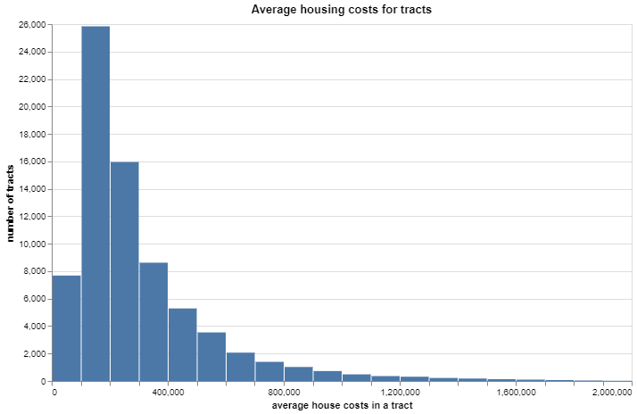
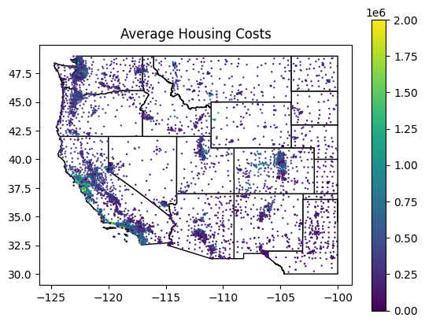
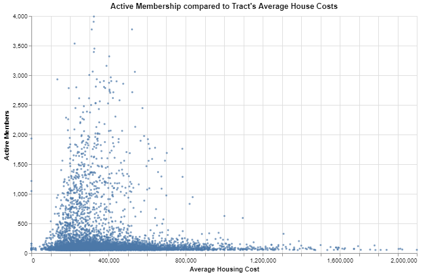

# Project Report on church membership from Safegraph Data

This repository contains an application to view a report about the membership to the church of Jesus Christ of Latter-Day Saints accross the USA.

Location of github respository
https://github.com/spence3033/app_challenge_membership_fa23

## Viewing the Application

Requirement to run this repository: You will need to install [Docker] (https://www.docker.com/get-started/)

Within this repository, you can simply run `docker compose up` to leverage the `docker-compose.yaml` with your local folder synced with the container folder where the streamlit app is running. 

Additionally, you can use `docker build -t streamlit .` to use the `Dockerfile` to build the image and then use `docker run -p 8501:8501 -v "$(pwd):/app:rw" streamlit` to start the container with the appropriate port and volume settings.

We currently use `python:3.11.6-slim` in our [Dockerfile](Dockerfile).  You can change to `FROM quay.io/jupyter/minimal-notebook` to use the [minimal Jupyter notebook](https://quay.io/organization/jupyter)

## Feature Comparison

I grabbed census data for the number of house owners and average house costs. This first graph was just interesting to see the trend of average house costs and see that there are areas have high house costs and low house costs, and most being in the $200,000 dollar range.

Here is a interesting spatial map of the states on the west coast with their average house costs.

I filtered out membership over 400 and under 50 to see more clearly if there is a trend between house costs and membership. The most clustered dots that have higher membership tend to be in in tracts where houses cost $250k-350k range. This might be slightly to the right of the bell curve but it's hard to say. It's likely there is no comparison to be found between these features.

## Tools Used

### Docker

Docker creates a virtual enclosed environment to run applications. It isn't a virtual machine as a virtual machine simulates the operating system whereas docker uses the computer's operating system that already exists. Therefore it isn't so heavy to startup a docker container to run an application. Also docker still has it's own isolated user space that doesn't use outside dependencies to run. Therefore you can run an application on this docker container on anyone's computer regardless if they have installed programming languages or other tools. It only requires an operating system and docker.

### PySpark

PySpark is a Python library for Apache Spark, a distributed computing framework. It can efficiently handle large datasets across a cluster of machines. Therefore this is an important tool for big data processing where resources can be increased.

Why not use Pandas? (another python library)

Pandas operates in-memory, which makes it fast and efficient for working with smaller to medium-sized datasets that fit into the memory of a single machine.

### DataBricks

DataBricks provides a platform that integrates with Apache Spark, making it a powerful tool for the data science projects. It takes care of provisioning and scaling clusters based on the workload and it supports dynamic resource allocation, allowing clusters to automatically scale resources up or down based on the workload. This ensures efficient utilization of resources without manual intervention.

## Code Explanations - Getting Church Member Estimates

Before this begins, there has already be some filtering of the places data from Safegraph for churches and any duplicate placekeys in the places data have been dropped. We don't want data to be replicated when we start joined the data together.

#### Code Block 5

In this code block, we filter some datasets from accross the USA and we also get some subsets for just Idaho. The phone patterns data gets filtered for church buildings by doing a semi-join. We then filter phone patterns for patterns data during 2019. We are now ready to perform logic on the datasets. In preparation for this we save these data sets as SQL tables. The tables created are places data, phone patterns data, tract data, and spatial data for the USA and some smaller tables with only data for Idaho.

_Bugs or potential improvements_

I did not find any potential bugs. There were two lines of code that were unnecessary though. The spatial data was filtered in code block 4 just above, so I assume it got filtered twice when it didn't need to be. Also, to filter for phone data from 2019, two columns were created for the month and year but the month column didn't have to get created, it wasn't used in the filter. So that could be cut out as well.

#### Code Block 22

In this code block, we take the phone patterns data for churches and split apart the day popularity. Then we order the day popularity and rank the days. So if Sunday is the most visited day during a month, it would be rank 1 and so forth for the other days. With the ranks for the different days, we group this data together for each place and get percentiles of this data. Most importantly we get the 70% percentile for Sundays and Mondays. Then we filter churches to see if roughly 70% of Sundays are within the rank of 1-3, meaning roughly 70% of Sundays are the most popular day for a place. Then we also filter the churches to see if the 70th percentile of Mondays is the within rank 4-7. Then we join all the places data to these churchs that have Sunday as a very popular day and with Monday as a generally unpopular day. Then this places data is then saved as a SQL table.

_Bugs or potential improvements_

First, I'm concerned about the 70 perentile of Mondays being in the 4-7 rank. I'm wondering if the hope was for 70% of Mondays to be an unpopular day or if it was correctly being expected that at least 30% of Mondays need to be an unpopular day.

I have one other worry. Single wards may want to their family home evening night activities at the church. I don't know if this happens much, but if a ward is very spread out, the church may be the best place to have FHE night. So this might make Monday a more popular day.

#### Code Block 50

**We retrieved a list of churches for Idaho that was found on an offical website for the Church of Jesus Christ of Latter-Day Saints. Before this code block, a table was created with the places data from safegraph and the distance from the place to the nearest church building from the official website from the Church of Jesus Christ.**

**We are aware that safegraph doesn't get perfect latitude and longitude numbers and exact addresses. We can use distance though between church buildings as a check in case we are uncertain if a place in safegraph is a church building.**

We take the list of churches that followed the right pattern of 70th_quartile usage on Sunday and Monday and join in the data of distances to the nearest church from the official website. We then filter for safegraph churches that have Sunday as rank 1 for 70th percentile an if Sunday is rank 2 there needs to be a recorded distance found to a church from the official church website. (That way we get rid of safegraph data that was put in extremely poorly. We don't want to trust a place that has no recorded location.) Lastly, if Sunday is rank 3 then the distance better be almost nothing between the two buildings. If Sunday is pushing it, we want to make sure this safegraph place lands almost exactly where a church is located from the Church of Jesus Christ website. Then as a precation we drop duplicate placekeys.

_Bugs or potential improvements_

This code is extremely good. I can't think of a nicer way of doing this. It gives as much benifit of the doubt as we can give with safegraph information but not so much that we can't trust the building to be a church building.

#### Code Block 60

In this code block, we are determining what the number of active members are to a church building. We take the phone patterns data for the church buildings we have since filtered for and explode out the visits_by_day data column. This means we now have visits for each individual day over each month for these church buildings. We filter the days for only Sunday visits. Now we get the median visits for Sunday visits for each of the months for a church building.
We are assuming the median Sunday visits should be roughly the number of active members attending a church building. 

Now we have to get over the hurdle that the raw visits in safegraph is only a small part of all of the visits to a church building. Safegraph luckily records the expected number of visits for each building based on a state's mobile device sampling rate. So here we make the assumption that the ratio of active church members to the visits from the phone sample will be the same as the ratio of actual active church members to the expected full number of visits.

To get this approximated value of active members, we get a ratio of the median Sunday visits over the monthly visits based on the phone sample and then multiply this ratio to the expected number of visits. Now we have the approximated active sunday members for each month to a church building. From this we get the median, maximum, and minimum of active members to a church building from month to month. We will use this in later calculations. We finally save this data into a SQL table.

_Bugs or potential improvements_

I cannot see any improvements to this code. We had some class projects where we compared mutiple ways to estimate the active number of members but I feel like this way is the best approximate.

#### Code Block 64

In this code block, we figure out the distribution weight ratio of members to their home tracts. We will try to filter out friends or family though that are visiting from far away. To do this we create a type of score based on the distance to home tracts and the number of visitors. If the score is too high, they will be filtered out. I'll explain the process in the next paragraphs.

First we total up the number of tract visitors to a church during a month. Then we find the product of tract distance by the number of visitors from a tract. Then we sum these products for a year for each church building. The purpose of summing these products is we have gotten the total distance between every visitor's home tract to a church building over the course of the year. Now we'll get the total number of visitors to a church building over a year. Here we will divide the total visitors to a church building by the total distance of visitor's home tracts to the church building. This number will be the average distance away church members home tracts are from the church they go to.

Now we get the standard deviation of distance of tracts to the church building for the whole year. We then use this standard deviation to give out z-scores of tracts to the church building. A tract that is the average distance away from a church building will get a z-score of 0. If the tract is 1 standard deviation distance away, the z-score is 1. If it's 1 standard deviation distance closer it's -1. Using this calculation, we filter out any visitors with their home tracts that are 2 standard deviation distances beyond the average home tract distance away.

Now we further filter out visitors from tracts. A tract needs to have members attend at least 3 church buildings or have at least 2 months of data. That way we filter out random visitors that showed up only one month. If the distribution to different church buildings is high enough though, we'll keep it. 

Now we can finally get our tract weights to church buildings. We divide each total of tract visitors by the total number of visitors to a church building for the course of a year. This gets the weight distribution. We will also save how many months of data we counted for each tract. Finally, we save this data to a SQL table.

_Bugs or potential improvements_

I cannot see a way of improving this. I have tried to see if the z-score method could be improved but I cannot think of a better way.

#### Code Block 66

Now we are ready to disperse the active members to the correct tracts. We take the tract distribution weights to disperse church building visitors. We disperse the median active member counts if it's above 16, but if lower we'll use the maximum visitor counts from each month to a church building. In theory, if church attendance is way too small, we decided that the safegraph data probably got an innacurrate number of members to that church building so we take that max number we found to try to overcome that. Lastly, we total up all of the members to each tract and round the amount to the nearest whole number and save this data.

_Bugs or potential improvements_

This code is pretty simple and doesn't have any bugs.

#### Code Block 74

In this final code block, we grab some census religion data to see what there number of members of The Church of Jesus Christ of Latter-Day Saints is compared to our active member estimates. We also get a ratio of active member estimates to tract populations. We save these ratios with the active member estimates in one final table.

_Bugs or potential imporvements_

There is no logic being done here to get active member estimates.